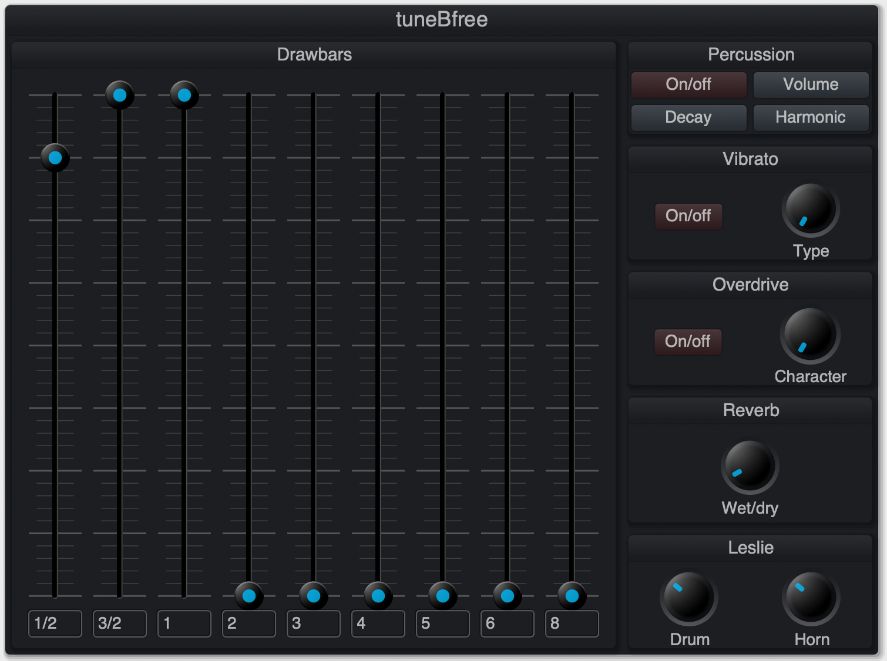

tuneBfree
=========

tuneBfree is a fork of the wonderful tonewheel organ plugin
[setBfree](https://github.com/pantherb/setBfree) with:
- microtonal scale support using [MTS-ESP](https://github.com/ODDSound/MTS-ESP)
- a [CLAP](https://github.com/free-audio/clap) plugin with a new GUI

Built plugins for Mac, Windows, and Linux are available on the
[releases page](https://github.com/narenratan/tuneBfree/releases).

Background
----------

Tonewheel organs, like the Hammond organ, contain a large number of tonewheels,
rotating disks which produce a single frequency. When playing a given note on
the organ, one tonewheel produces its fundamental, while *other tonewheels*
produce the higher partials. This is very interesting for microtonal music,
since the partials are automatically chosen from the notes of the scale of the
organ; we have a physical implementation of
[Sethares-style timbre-tuning adaptation](https://sethares.engr.wisc.edu/ttss.html).

For example, there is no beating between the partial around 3 times the
frequency of C and the G an octave above, since they are produced by exactly
the same tonewheel and so have exactly the same frequency. This is true
regardless of whether your tuning has fifths close to 3/2; on a tonewheel
organ, fifths far from 3/2 give an inharmonic timbre rather than beating.

The rotating Leslie speaker often used with Hammond organs and modelled in
setBfree (and so tuneBfree) can also be helpful for microtonal tunings by
'taking the edge off' with some subtle or not-so-subtle chorusing.

So altogether the tonewheel organ is really well suited to microtonal music.
It sounds great to me, and it's also doing something rather interesting.

Using tuneBfree
---------------

The tuning can be set using an MTS-ESP source like
[MTS-ESP Mini](https://oddsound.com/mtsespmini.php) or
[Surge XT](https://surge-synthesizer.github.io).

The original Hammond organ had partials at frequencies approximating 1/2, 3/2,
1, 2, 3, 4, 5, 6, 8 times the frequency of the fundamental. The amount of each
frequency is controlled by the drawbars. In tuneBfree, the closest tonewheel to
each of these frequencies in your tuning is used. You can even type in new
ratios for the drawbars to approximate, so the range of timbres available is
quite large.



[Arseniiv](https://github.com/arseniiv) wrote a great guide to tuning tuneBfree
which is in the repo
[here](https://github.com/narenratan/tuneBfree/blob/main/guide.md) — thanks
very much for that!

Building
--------

To build you can run:
```
$ git clone --recurse-submodules https://github.com/narenratan/tuneBfree/
$ cd tuneBfree/src
$ cmake -B build -D CLAP_GUI=true -D CMAKE_BUILD_TYPE=Release
$ cmake --build build --config Release
```

To install the build dependencies for the Elements GUI on Windows you can run
```
$ ./libs/vcpkg/bootstrap-vcpkg.bat
$ ./libs/vcpkg/vcpkg.exe install pkgconf:x64-windows-static cairo:x64-windows-static libwebp:x64-windows-static
```
(this may take fifteen minutes or so).

Thanks to all the setBfree contributors for making such a great plugin!

*Naren Ratan*
